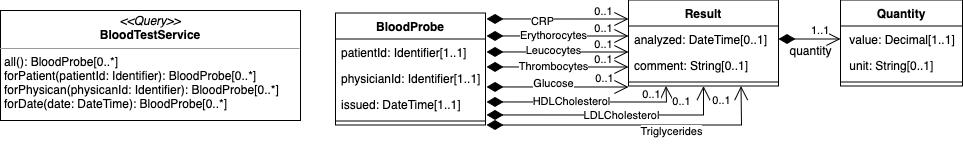

# Semantic Interoperability of Software Systems

This directory contains a small _CorrLang_ use case that is based on the following scenario:


For the sake of simplicity, all endpoints are using GraphQL web service as means of communication and only the three systems

* `GP`: The journal system of General Practicioner (using a simplified FHIR data model)
* `HOSP`: The journal system of a hospital (using the same simplified FHIR data model)
* `LAB`: A Database with laboratory test results (using a custom made schema)

are featured in this use case.
The respecitve data models are shown below.





The main **goal** in this scenario is to use _CorrLang_  

* to make the data of all systems accessible behind a homogenous interface,
* to identify and represent shared data, and 
* to check shared data for inconsistencies.


## Running the endpoints

All systems can be started simultaneosly by running 
```
./runEndpoints.sh
```

in a command line (requires CYGWIN on Windows). 
This also requires JAVA >= 11 (check that the respective path in `globalVars.properties` is correct.

You should see something like
```
Waiting for endpoints to start up (usually takes around 5-10 seconds)
Endpoint 'GP' (PID=70651) running at http://localhost:9001/graphql
Endpoint 'HOSP' (PID=70737) running at http://localhost:9002/graphql
Endpoint 'LAB' (PID=70707) running at http://localhost:9003/graphql
Press any key to terminate
```

You will now find three GraphQL endpoints behind these URLs.
Use a GraphQL client (I personally can recommedn: [Hoppscotch](https://hoppscotch.io/)) to explore them and the data that is contained in them.

To terminate the applications, just press [ENTER] in the shell window (Please ignore the `BUILD FAILED` messages that you may receive afterwards).

## Running CorrLang


